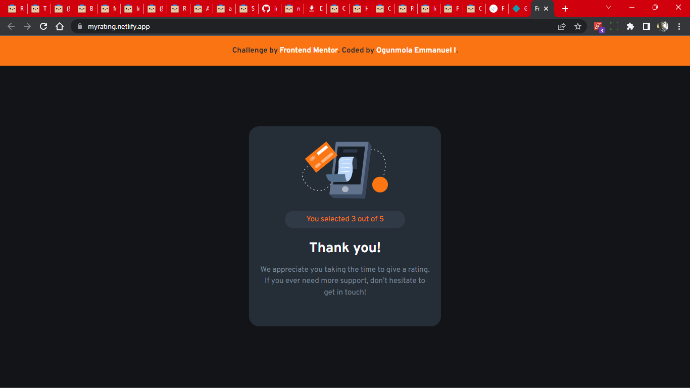

# Frontend Mentor - Interactive rating component solution

This is a solution to the [Interactive rating component challenge on Frontend Mentor](https://www.frontendmentor.io/challenges/interactive-rating-component-koxpeBUmI). Frontend Mentor challenges help you improve your coding skills by building realistic projects.

## Table of contents

- [Overview](#overview)
  - [The challenge](#the-challenge)
  - [Screenshot](#screenshot)
  - [Links](#links)
- [My process](#my-process)
  - [Built with](#built-with)
  - [What I learned](#what-i-learned)
  - [Continued development](#continued-development)
- [Author](#author)
- [Acknowledgments](#acknowledgments)

## Overview

### The challenge

Users should be able to:

- View the optimal layout for the app depending on their device's screen size
- See hover states for all interactive elements on the page
- Select and submit a number rating
- See the "Thank you" card state after submitting a rating

### Screenshot



### Links

- Solution URL: [https://www.frontendmentor.io/solutions/card-component-using-flexbox-lpJiu-QGkI]
- Live Site URL: [https://myrating.netlify.app/]

## My process

### Built with

- Semantic HTML5 markup
- CSS custom properties
- Flexbox
- Mobile-first workflow

### What I learned

These lines of Javascript code helped me to practice what I learnt from my JavaScript course

```js
ratings.forEach(ratings => ratings.classList.remove('selected'));
clicked.classList.add('selected');
```

### Continued development

I'd like to be able to replicate such confidence with more advanced JS projects

## Author

- Website - [https://github.com/OGEmanuel]
- Frontend Mentor - [https://www.frontendmentor.io/profile/OGEmanuel]
- Twitter - [https://twitter.com/its_GODwithMe]

## Acknowledgments

This project was done courtesy of Dev Career and My leader Hikmot.
